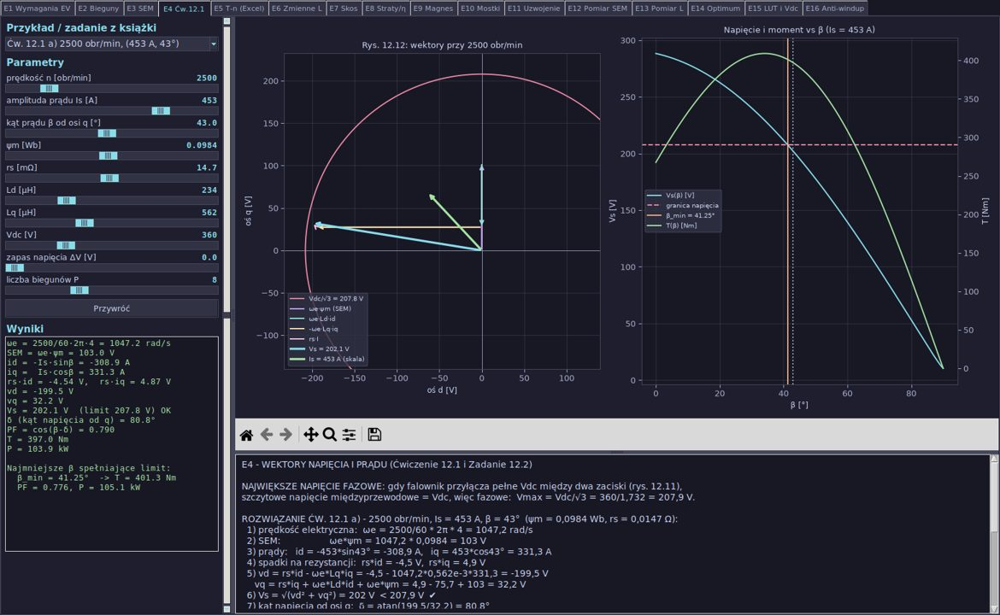
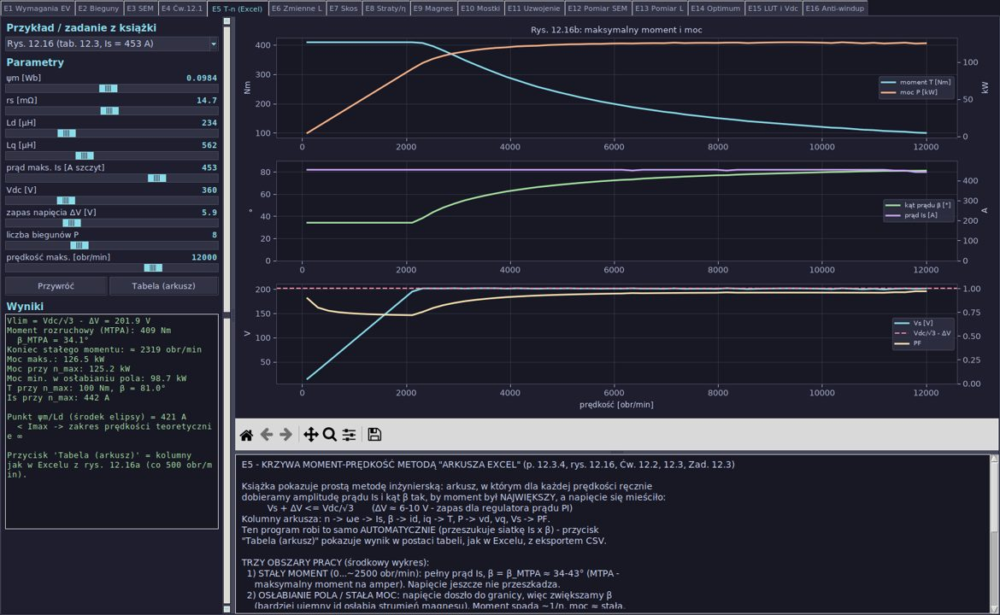
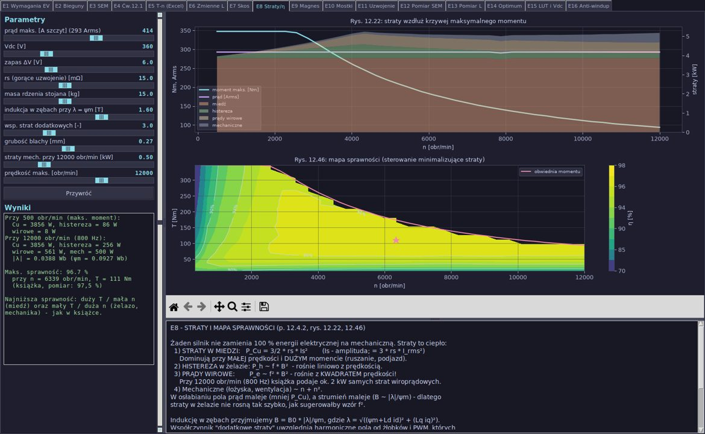
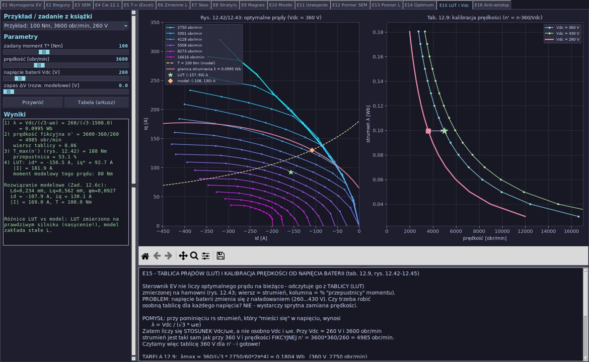
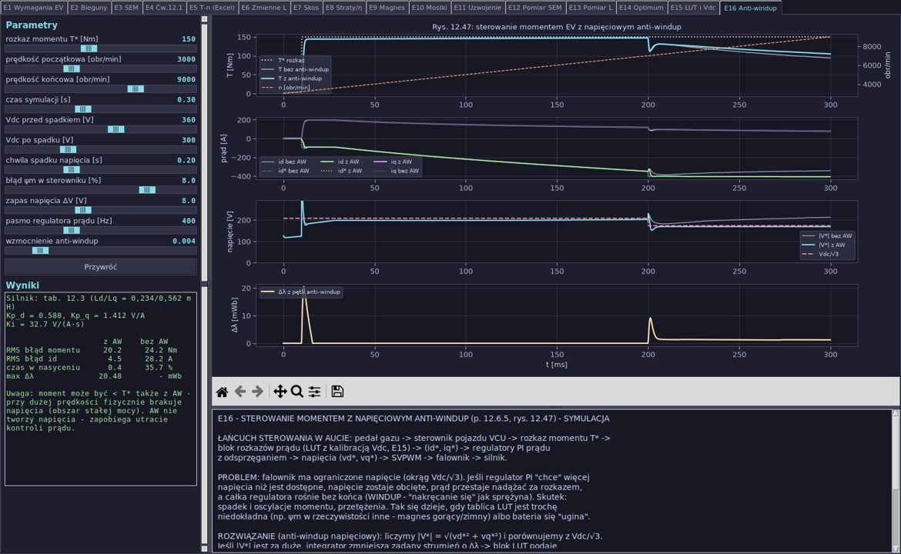

# Projekt i sterowanie silnikiem pojazdu elektrycznego (IPMSM), rozdział 12

Plik `ev_motor_design_control_tkinter.py` to interaktywna aplikacja Tkinter + Matplotlib, która obejmuje
**wszystkie przykłady, ćwiczenia (Exercise 12.1–12.5) i zadania (Problems 12.1–12.10)** z rozdziału
*„EV Motor Design and Control”*. Ma 16 zakładek. Na każdej są:

* **presety** („Przykład / zadanie z książki”), które jednym kliknięciem wpisują dane z treści zadania,
* **suwaki** wszystkich parametrów z bieżącą wartością obok,
* **wykresy** (z paskiem Matplotlib: zoom, przesuwanie, zapis PNG),
* okienko **„Wyniki”** z obliczeniami krok po kroku,
* **objaśnienie dla ucznia liceum** z komentarzem inżyniera,
* w zakładkach E5, E6, E14 i E15 przycisk **„Tabela (arkusz)”**. Otwiera on tabelę jak w Excelu i pozwala ją zapisać do CSV.

```
pip install numpy matplotlib
python ev_motor_design_control_tkinter.py
```
(tkinter jest częścią Pythona. Na Linuksie może być potrzebny pakiet `python3-tk`.)



## Konwencje (takie same jak w książce)

| Symbol | Znaczenie |
|---|---|
| `P` | liczba **biegunów** (np. 8); `p = P/2` to liczba par biegunów |
| `ωe = n/60 · 2π · P/2` | prędkość elektryczna [rad/s] |
| `Is`, `id`, `iq`, `vd`, `vq` | wartości **szczytowe** (amplitudy) |
| `β` | kąt prądu mierzony od osi q: `id = −Is·sin β`, `iq = Is·cos β` |
| moment | `Te = (3P/4)·[ψm·iq + (Ld − Lq)·id·iq]` |
| napięcia | `vd = rs·id − ωe·Lq·iq`, `vq = rs·iq + ωe·(Ld·id + ψm)` |
| granica napięcia | `Vs + ΔV ≤ Vdc/√3` (SVPWM, zakres liniowy) |

## Zakładki

| Zakładka | Temat w książce | Co liczy / pokazuje |
|---|---|---|
| E1 Wymagania EV | 12.1, rys. 12.1, tab. 12.1–12.2 | siła na kołach: ICE z 5 biegami vs EV z jednym przełożeniem, sprawdzenie danych Leafa, 0–100 km/h |
| E2 Bieguny | 12.2.1–12.2.2 | f = n/60·P/2, q = Ns/(3P), warstwy Ns/P ± 2, straty w żelazie (histereza i prądy wirowe) a grubość blachy, masa jarzma a P |
| E3 SEM | 12.3.1, rys. 12.10 | ψm z SEM, wpływ temperatury magnesu (−0,12 %/K), widmo, SEM przy n_max a Vdc/√3 |
| E4 Ćw. 12.1 | Ćw. 12.1, Zad. 12.2 | wykres wektorowy w dq, Vs(β), T(β), najmniejsze β mieszczące się w napięciu |
| E5 T-n (Excel) | 12.3.4, rys. 12.16, Ćw. 12.2, 12.3, Zad. 12.3 | automatyczny „arkusz Excel”: T, P, β, Is, Vs, PF w funkcji prędkości |
| E6 Zmienne L | 12.3.3, rys. 12.15/12.17, Zad. 12.8 | moment z tabelą Ld(β), Lq(β), porównanie ze stałym L |
| E7 Skos | 12.4.1, rys. 12.20 | tętnienia momentu, współczynnik skosu k_h dla N segmentów |
| E8 Straty/η | 12.4.2, rys. 12.22, 12.46 | straty w miedzi, histerezowe, wiroprądowe i mechaniczne, mapa sprawności |
| E9 Magnes | 12.4.3, tab. 12.8, rys. 12.23 | krzywe B-H magnesu N39UH, prosta obciążenia, kolano, cykl 60→180→60 °C |
| E10 Mostki | 12.4.4, tab. 12.5 | naprężenie od siły odśrodkowej w mostkach, strumień rozproszenia |
| E11 Uzwojenie | 12.5.1, 12.6.1, Zad. 12.1, 12.9 | wypełnienie żłobka, J, długość zwoju, R(ϑ), straty w miedzi, okładzina prądowa |
| E12 Pomiar SEM | 12.6.2, Ćw. 12.4, Zad. 12.4, 12.8a, 12.10 | FFT napięcia jałowego → ψm, szereg Fouriera SEM trapezowej (BLDC) |
| E13 Pomiar L | 12.6.3, rys. 12.35–12.36, Zad. 12.7b | wyznaczanie Ld, Lq z napięć w stanie ustalonym, wpływ szumu i błędów |
| E14 Optimum | 12.6.4, rys. 12.40–12.41, Zad. 12.5 | symulacja algorytmu poszukiwania optymalnego prądu na hamowni |
| E15 LUT i Vdc | tab. 12.9, rys. 12.42–12.45, Ćw. 12.5, Zad. 12.6 | pełna tablica LUT z rys. 12.43, prędkość fikcyjna, interpolacja dwuliniowa |
| E16 Anti-windup | 12.6.5, rys. 12.47 | symulacja dynamiczna regulacji prądu z ograniczeniem napięcia, z anti-windup i bez |

---

## Rozwiązania krok po kroku (tak, jak dla ucznia liceum)

### E1: dlaczego silnik EV nie potrzebuje skrzyni biegów
Silnik spalinowy nie daje momentu przy zerowych obrotach i pracuje dobrze tylko w wąskim zakresie,
dlatego potrzebuje biegów. Silnik elektryczny daje pełny moment od zera: najpierw **stały moment**
(ogranicza go prąd), potem **stałą moc** (ogranicza ją napięcie baterii).
Sprawdzenie Nissana Leafa 2018: `P = T·ω = 320 Nm · (3283·2π/60) = 320 · 343,8 = 110 kW` ✔.
Zakres stałej mocy to 3283…9795 obr/min, czyli około 3× prędkości bazowej.

### E2: bieguny, żłobki, częstotliwość
`q = Ns/(3P) = 48/(3·8) = 2`, a dla BMW i3 `72/(3·12) = 2`.
BMW i3 przy 11 400 obr/min: `f = 11400/60 · 6 = 1140 Hz`. Dlatego stosuje się bardzo cienką blachę 0,2 mm,
bo straty wiroprądowe rosną z kwadratem grubości: `(0,2/0,27)² = 0,55`.
Współczynniki strat wyliczone z katalogu blachy 27PNF1500 (W15/50 = 2,03 W/kg, W10/400 = 13,3 W/kg):
`kh = 0,01587`, `ke = 4,34·10⁻⁵`. To układ dwóch równań z dwiema niewiadomymi.
Zalecana liczba warstw barier dla 48/8: `Ns/P ± 2 = 6 ± 2 → 4 lub 8`.

### E3: SEM i temperatura
`ωe = 3600/60 · 2π · 4 = 1508 rad/s`, `ψm = 143,8/1508 = 0,095 Wb` (przy 140 °C).
Przy 20 °C: `ψm = 0,095·(1 + 0,0012·120) = 0,109 Wb`. Zimny magnes przy 12 000 obr/min daje SEM ≈ 548 V,
znacznie więcej niż `Vdc/√3 = 208 V`. Gdy falownik straci sterowanie, grozi to niekontrolowanym ładowaniem baterii i uszkodzeniem IGBT.

### E4: Ćwiczenie 12.1 i Zadanie 12.2
Największe napięcie fazowe: `Vdc/√3 = 360/1,732 = 207,9 V`.

| | a) 2500 obr/min, 453 A, 43° | b) 7200 obr/min, 453 A, 75,25° | c) 12 000 obr/min, 453 A, 80,75° |
|---|---|---|---|
| ωe [rad/s] | 1047,2 | 3015,9 | 5026,5 |
| id / iq [A] | −308,9 / 331,3 | −438,1 / 115,3 | −447,1 / 72,8 |
| vd / vq [V] | −199,5 / 32,2 | −201,9 / −10,7 | −212,3 / −30,2 |
| Vs [V] | **202,1 ✔** | **202,2 ✔** | **214,4 ✘** |
| PF | 0,79 | 0,95 | 0,95 |
| T [Nm] | 397 | 168 | 107 |

Szczegółowo a): `vd = rs·id − ωe·Lq·iq = −4,5 − 1047,2·0,562·10⁻³·331,3 = −199,5 V`,
`vq = rs·iq + ωe·Ld·id + ωe·ψm = 4,9 − 75,7 + 103 = 32,2 V`, `Vs = 202 V`,
`δ = atan(199,5/32,2) = 80,8°`, `PF = cos(β − δ) = cos(−37,8°) = 0,79` ✔ (zgodnie z książką).
**Uwaga:** w przypadku c) dla dokładnie podanych danych napięcie **przekracza** 207,9 V. Program pokazuje, że
potrzebne jest β ≥ 81,1° (wtedy T ≈ 103 Nm) albo trochę mniejszy prąd.
**Zad. 12.2** (tab. 12.3, 10 000 obr/min, 350 A): przy β = 55° wychodzi Vs = 489 V, czyli za dużo.
Najmniejsze dopuszczalne β = **76,7°**, T ≈ 99 Nm, PF ≈ 1,00.

### E5: krzywa moment-prędkość („arkusz Excel”)
Program przeszukuje siatkę (Is, β) przy każdej prędkości i wybiera największy moment spełniający `Vs ≤ Vdc/√3 − ΔV`.
Dla tab. 12.3 (453 A, ΔV = 5,9 V) wychodzi: moment rozruchowy **409 Nm** (książka: 406 Nm), β_MTPA = 34°,
stały moment do ok. 2300–2500 obr/min, moc ok. 120–126 kW aż do 12 000 obr/min.
Ćw. 12.2 (ψm = 0,103 Wb, 280 A): T_start ≈ 217 Nm, P_max ≈ 83 kW, przy 10 000 obr/min ≈ 59 kW.
Ćw. 12.3 (212 A, 325 V): przy założonych Ld, Lq z tab. 12.3 moc szczytowa wynosi ≈ 58,5 kW, czyli trochę poniżej 60 kW.
Tabela z rys. 12.19 (zmienne L) jest nieczytelna w załączniku, więc przyjęto stałe L. Z inną indukcyjnością wynik się zmieni.
Zad. 12.3 (ψm = 0,09 Wb, 280/500 µH, 325 V): T_start ≈ 177 Nm, P ≈ 74–75 kW przy wysokich prędkościach.



### E6: Zadanie 12.8 (autobus EV, 12 biegunów, 420 A, 600 V)
a) `ωe = 300/60·2π·6 = 188,5 rad/s`, `ψm = 67,482/188,5 = 0,358 Wb` (przyjęto, że 67,482 V to amplituda).
b) Z tabeli Ld(β), Lq(β) maksimum momentu wypada przy **β ≈ 35°, T ≈ 1800 Nm**. Przy stałym L model przeszacowałby moment
(≈ 1860 Nm przy 32°). Dla β = 45°: `T = 9·(0,358·297 + 0,001·297·297) ≈ 1750 Nm`.
c) Moment i moc przy 300…3200 obr/min (Vmax = 346 V):

| n [obr/min] | 300 | 600 | 900 | 1000 | 1180 | 1300 | 1500 | 1800 | 2300 | 3200 |
|---|---|---|---|---|---|---|---|---|---|---|
| T [Nm] | 1802 | 1802 | 1802 | 1776 | 1621 | 1509 | 1334 | 1133 | 883 | 626 |
| P [kW] | 57 | 113 | 170 | 186 | 200 | 205 | 210 | 214 | 213 | 210 |

### E7: tętnienia momentu i skos
Współczynnik skosu dla N segmentów: `k_h = sin(hθ/2) / (N·sin(hθ/(2N)))`.
Podziałka żłobkowa 48-żłobkowego stojana: 7,5° mech = 30° el, a pół podziałki: 3,75° mech = 15° el.
W prostym modelu skos 15° el tłumi 12. harmoniczną do 65 %, a 6. tylko do 91 %. Aby zejść z ok. 23 % do ok. 11 %,
trzeba skosu ok. 30° el. Książka podaje 28,5 % → 10 % na podstawie pełnej analizy MES.

### E8: straty i mapa sprawności
Miedź `1,5·rs·Is²` przeważa przy małej prędkości. Straty wiroprądowe rosną z f², a histerezowe z f.
Indukcja w zębach `B = B0·|λ|/ψm`, ograniczona do 1,9 T (nasycenie). Mapa sprawności powstaje z minimalizacji strat
dla każdego punktu (n, T). Maksimum wynosi ≈ 96,7 % w środku mapy (pomiar w książce: 97,5 %).
Straty dodatkowe to skalibrowany współczynnik, ponieważ prosty model nie widzi harmonicznych od żłobków i PWM.



### E9: rozmagnesowanie
N39UH: Br = 1,25 T, iHc = 1989 kA/m przy 20 °C. Przy 180 °C (przyjęte −0,45 %/K dla iHc) iHc ≈ 557 kA/m.
Dla 320 Arms, β = 43° (id = −309 A) punkt pracy leży przed kolanem krzywej, więc rozmagnesowanie jest
**odwracalne** i po ostygnięciu magnes wraca do 100 %, tak jak w książce. Suwakami (prąd, Pc) łatwo
znaleźć granicę, za którą strata staje się trwała.

### E10: mostki wirnika
`F = m·r·ω² = 0,3 · 0,07 · 1508² = 47,8 kN` (14 400 obr/min, czyli 12 000 + 20 %).
Dwa mostki 1,5 × 120 mm: `σ = 47,8 kN / 360 mm² = 133 MPa`, a z koncentracją naprężeń (K_t = 2,5) 332 MPa < 410 MPa ✔.
Przemieszczenie ≈ 3 µm < 10 µm. Szerszy mostek jest bezpieczniejszy, ale przepuszcza więcej strumienia rozproszenia.

### E11: uzwojenie (p. 12.5.1, Zad. 12.1, Zad. 12.9)
Silnik z książki: `z = 3` przewody/żłobek, miedź `π·0,51²·22·3 = 53,9 mm²` (książka: 54,3 mm²), wypełnienie 49,5 %.
`l_b = 1,3·67,15 + 3·24,45 + 2·3 = 166,7 mm`, zwój `2·(166,7 + 120) = 573 mm`, faza `24·0,573 = 13,8 m`,
`R20 = 0,021/22·13,8 = 0,013 Ω` ✔. Przy 150 °C rezystancja rośnie o 51 %.
**Zad. 12.1:** `A = 48·3·350/(π·15,6 cm) = 1028 A/cm`.
**Zad. 12.9:** z = 2, dla wypełnienia 44 % potrzeba **56 żył** drutu 1,0 mm. `τp = 62,8 mm`, `l_b = 162,7 mm`,
zwój 625 mm, faza 10,0 m, **R20 = 3,92 mΩ**, **R140 = 5,76 mΩ**, straty przy 160 Arms: **442 W**.

### E12: pomiar stałej SEM
**Ćw. 12.4:** `V_faz = 51,8·√2/√3 = 42,3 V`, `ωe = 418,9 rad/s`, **ψm = 0,101 Wb**.
**Zad. 12.4:** `V_faz = 100/√3 = 57,7 V`, `ωe = 3600/60·2π·3 = 1131 rad/s`, **ψm = 0,051 Wb**.
**Zad. 12.8a:** **ψm = 0,358 Wb**.
**Zad. 12.10 (BLDC):** `b_n = 4E/(π n² a)·sin(n a)`, gdzie a = 30°. Dla E = 100 V: b1 = 121,6, b3 = 27,0, b5 = 4,86,
b7 = −2,48, b9 = −3,00, b11 = −1,01, b13 = 0,72, b15 = 1,08 V (parzyste są zerowe). Okres T = π/2 mech daje 4 pary
biegunów, czyli **P = 8**. Przy 3000 obr/min: **ψm = 121,6/1256,6 = 0,0968 Wb**.

### E13: pomiar indukcyjności
Sprawdzenie arkusza z rys. 12.35 (500 obr/min):
`Lq = (0,0147·(−0,1) + 6,5)/(209,4·48,8) = 0,635 mH` ✔, `Ld = (17,0 − 19,41)/(209,4·(−49,3)) = 0,234 mH` ✔.
**Zad. 12.7b:** vd = −60,8 V, vq = 60,8 V. Przy β = 25° (prąd opóźniony o 20° względem napięcia pod kątem 45°):
id = −36,3 A, iq = 77,9 A, Lq = 0,621 mH. Ld zależy od ψm z części a), której oscylogram jest nieczytelny.
W programie ustawia się go suwakiem „napięcie jałowe”.

### E14: Zadanie 12.5 (4500 obr/min, 320 V)

| I [A] | 50 | 100 | 150 | 200 | 250 | 300 |
|---|---|---|---|---|---|---|
| β* [°] | 7 | 18 | 31 | 40 | 48 | 53 |
| id* [A] | −6 | −31 | −77 | −129 | −186 | −240 |
| iq* [A] | 50 | 95 | 129 | 153 | 167 | 181 |
| T [Nm] | 27 | 55 | 83 | 109 | 131 | 155 |

Przy małym prądzie optimum to szczyt krzywej T(β), czyli MTPA. Przy dużym leży ono na granicy napięcia.

### E15: tablica LUT i kalibracja od Vdc
`λmax = 360/(√3·1151,9) = 0,1804 Wb`, `λmin = 260/(√3·5026,5) = 0,0299 Wb`, 16 poziomów (tab. 12.9 odtworzona w całości).
Przykład z książki (100 Nm, 3600 obr/min, 260 V): λ = 0,0995 Wb, prędkość fikcyjna `n' = 3600·360/260 = 4985 obr/min`,
przepustnica 53 %. Z tablicy wychodzi (id*, iq*) ≈ (−157, 93) A. Książka, odczytując z wykresu, podaje (−140, 105) A.
**Ćw. 12.5** (300 V, 4200 obr/min, 110 Nm): n' = 5040 obr/min, (id*, iq*) ≈ (−178, 97) A.
**Zad. 12.6a** (185 Nm, 4500 obr/min, 360 V): ≈ (−323, 137) A. **12.6b** (320 V): n' = 5063 obr/min, ≈ (−414, 120) A.
**12.6c** (model ze stałymi L): (−279, 167) A, |I| = 325 A. Rozwiązanie modelowe daje mniejszy prąd, bo nie uwzględnia nasycenia, a tablica LUT je zawiera.



### E16: sterowanie momentem z napięciowym anti-windup
Symulacja dynamiczna (metoda Heuna, krok 10 µs) silnika z tab. 12.3 z regulatorami PI prądu
(`Kp = 2π·f_bw·L`, `Ki = 2π·f_bw·rs`), odsprzęganiem, ograniczeniem napięcia `Vdc/√3` i pętlą anti-windup.
Pętla ta zmniejsza zadany strumień o Δλ, gdy `|V*| > Vdc/√3`. Scenariusz: rampa prędkości 3000→9000 obr/min,
spadek baterii 360 → 300 V w 0,2 s, błąd ψm w sterowniku +8 %. Wynik: z anti-windup błąd id spada z 28 A do 4,5 A,
a czas pracy w nasyceniu napięcia z 36 % do 0,4 %.



---

## Założenia i ograniczenia (uczciwie)
* Modele są analityczne (dq, stan ustalony). Nie zastępują MES, ale pokazują te same zależności co w książce.
* Tam, gdzie załącznik nie zawiera danych (nieczytelne rysunki 12.19 i oscylogram z Zad. 12.7a, współczynnik
  temperaturowy iHc, masa bieguna wirnika), przyjęto typowe wartości i można je zmieniać suwakami.
* Symulacja z E16 wymusza prędkość (jak hamownia albo pojazd o dużej bezwładności). Mechanika pojazdu jest w E1.
